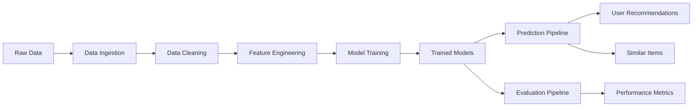

# Pipeline Orchestration

This directory contains the complete pipeline orchestration for the game recommendation system. It provides end-to-end workflows for training, prediction, and evaluation, integrating all components of the data processing and modeling stack.

## Overview

The pipeline system consists of three main workflows:
1. **Training Pipeline** - End-to-end model training from raw data to trained models
2. **Prediction Pipeline** - Real-time inference engine for recommendations and similarity search
3. **Evaluation Pipeline** - Model performance assessment and metrics reporting

## Pipeline Architecture



## Modules

### 1. train_pipeline.py

**Purpose**: Orchestrates the complete end-to-end training workflow.

**Class**: `TrainingPipeline`

**Functionality**:

**Environment Setup**:
- Configures TensorFlow environment variables for optimal performance
- Sets legacy Keras compatibility flags
- Manages CPU/GPU device allocation

**Pipeline Stages**:
1. **Data Ingestion** (`LoadDataService`)
   - Downloads raw datasets from configured URLs
   - Stores data in `data/raw/` directory
   
2. **Data Cleaning** (`CleanDataService`)
   - Processes raw user-item interactions
   - Merges with game metadata
   - Outputs cleaned CSV to `data/processed/`

3. **Feature Engineering** (`FeatureEngineeringService`)
   - Creates implicit ratings from playtime
   - Generates item text features
   - Splits into train/test sets

4. **Model Training** (`ModelTrainingService`)
   - Trains specified model type (Autoencoder, MF, or TFRS)
   - Logs experiments to MLflow
   - Saves trained models and context artifacts

**Configuration**: Reads from `configs/pipeline_params.yaml`

**Usage**:
```python
from train_pipeline import TrainingPipeline

# Initialize pipeline
pipeline = TrainingPipeline(model_type='matrix_factorization')

# Run complete training workflow
pipeline.train_model()
```

**Command Line**:
```bash
python src/pipeline/train_pipeline.py
```

---

### 2. predict_pipeline.py

**Purpose**: Inference engine for generating recommendations and finding similar items.

**Class**: `PredictionPipeline`

**Functionality**:

**Initialization**:
- Loads specified model type (`tfrs`, `mf`, or `autoencoder`)
- Loads trained model artifacts from `artifacts/models/`
- Loads context artifacts (encoders, vocabularies) from `artifacts/context/`
- Prepares candidate item lists for efficient retrieval

**Core Methods**:

#### `recommend(user_id, top_n=10)`
- **Purpose**: Generate personalized recommendations for a user
- **Input**: User ID (string or integer)
- **Output**: List of top-N recommended game names
- **Process**:
  1. Encodes user ID using saved encoder
  2. Retrieves top candidates using model
  3. Decodes item IDs back to game names
  4. Returns ranked list

#### `get_similar_items(item_name, top_n=10)`
- **Purpose**: Find games similar to a given item
- **Input**: Item name (string)
- **Output**: List of top-N similar game names
- **Process**:
  1. Encodes item name to item ID
  2. Retrieves embeddings or uses retrieval index
  3. Computes similarity scores
  4. Returns ranked similar items

**Model-Specific Behavior**:
- **Autoencoder**: Uses learned embeddings with cosine similarity
- **Matrix Factorization**: Uses item embeddings with dot product
- **TFRS**: Uses ScaNN index for efficient approximate nearest neighbor search

**Usage**:
```python
from predict_pipeline import PredictionPipeline

# Initialize pipeline
predictor = PredictionPipeline(model_type='tfrs')

# Get recommendations for a user
recommendations = predictor.recommend(user_id='76561197970982479', top_n=10)
print(f"Recommended games: {recommendations}")

# Find similar items
similar_games = predictor.get_similar_items(item_name='Counter-Strike', top_n=5)
print(f"Similar to Counter-Strike: {similar_games}")
```

---

### 3. evaluate_pipeline.py

**Purpose**: Simplified wrapper for running model evaluation.

**Functionality**:
- Loads trained models
- Runs evaluation on test data
- Logs metrics to MLflow
- Delegates to `ModelEvaluationService`

**Usage**:
```python
from evaluate_pipeline import run_evaluation

# Run evaluation for specific model
run_evaluation()
```

**Command Line**:
```bash
python src/pipeline/evaluate_pipeline.py
```

## Configuration

### Pipeline Configuration File

**Path**: `configs/pipeline_params.yaml`

```yaml
Training_pipeline:
  data_config_path: "configs/config.yaml"           # Data processing config
  training_config_path: "configs/model_params.yaml" # Model training config
```

### Related Configuration Files

The pipeline system integrates with multiple configuration files:

| Config File | Purpose | Used By |
|------------|---------|---------|
| `configs/config.yaml` | Data ingestion, cleaning, feature engineering paths | Training Pipeline |
| `configs/model_params.yaml` | Model hyperparameters, training settings | Training Pipeline |
| `configs/pipeline_params.yaml` | Pipeline orchestration settings | All Pipelines |

## Complete Workflow

### End-to-End Training Workflow

```python
# Complete example of training all models
from train_pipeline import TrainingPipeline

# Train Autoencoder
ae_pipeline = TrainingPipeline(model_type='autoencoder')
ae_pipeline.train_model()

# Train Matrix Factorization
mf_pipeline = TrainingPipeline(model_type='matrix_factorization')
mf_pipeline.train_model()

# Train TFRS
tfrs_pipeline = TrainingPipeline(model_type='tfrs')
tfrs_pipeline.train_model()
```

### Production Inference Workflow

```python
from predict_pipeline import PredictionPipeline

# Initialize predictor (loads trained model)
predictor = PredictionPipeline(model_type='tfrs')

# Serve recommendations
def get_user_recommendations(user_id):
    """Get personalized recommendations for a user."""
    return predictor.recommend(user_id=user_id, top_n=10)

def find_similar_games(game_name):
    """Find games similar to the given game."""
    return predictor.get_similar_items(item_name=game_name, top_n=5)

# Example usage
user_recs = get_user_recommendations('76561197970982479')
similar = find_similar_games('Half-Life 2')
```

## API Reference

### TrainingPipeline Class

**Constructor**:
```python
TrainingPipeline(model_type: str, config_path: str = 'configs/pipeline_params.yaml')
```
- `model_type`: One of `'autoencoder'`, `'matrix_factorization'`, or `'tfrs'`
- `config_path`: Path to pipeline configuration file

**Methods**:
- `train_model()`: Executes complete training workflow

### PredictionPipeline Class

**Constructor**:
```python
PredictionPipeline(model_type: str)
```
- `model_type`: One of `'autoencoder'`, `'mf'`, or `'tfrs'`

**Methods**:
- `recommend(user_id: str, top_n: int = 10) -> List[str]`
  - Returns top-N recommended game names for a user
  
- `get_similar_items(item_name: str, top_n: int = 10) -> List[str]`
  - Returns top-N similar games to the given item

## Pipeline Execution Order

For a complete system setup, execute in this order:

```bash
# 1. Train models (one at a time or all)
python src/pipeline/train_pipeline.py

# 2. Evaluate model performance
python src/pipeline/evaluate_pipeline.py

# 3. Use prediction pipeline for inference
# (Typically integrated into application code)
```

## Output Artifacts

The pipelines generate and consume the following artifacts:

**Data Artifacts** (from Training Pipeline):
```
data/
├── raw/
│   ├── australian_users_items.json.gz
│   └── steam_games.json.gz
├── processed/
│   ├── australian_users_items_merged.csv
│   ├── transformed_df.csv
│   ├── train.csv
│   └── test.csv
```

**Model Artifacts** (from Training Pipeline, used by Prediction Pipeline):
```
artifacts/
├── models/
│   ├── autoencoder_model.h5
│   ├── mf_model.h5
│   └── tfrs_model/
└── context/
    ├── user_encoder.pkl
    ├── item_encoder.pkl
    ├── tfidf_vectorizer.pkl
    ├── user_vocab.pkl
    ├── item_vocab.pkl
    └── candidate_dataset.pkl
```

**MLflow Artifacts**:
```
mlruns/
└── 0/
    └── <experiment_id>/
        ├── metrics/
        ├── params/
        └── artifacts/
```

## Integration with Web Application

The prediction pipeline is designed to integrate seamlessly with web applications:

```python
# Example Flask integration
from flask import Flask, request, jsonify
from predict_pipeline import PredictionPipeline

app = Flask(__name__)
predictor = PredictionPipeline(model_type='tfrs')

@app.route('/recommend/<user_id>', methods=['GET'])
def recommend(user_id):
    top_n = request.args.get('top_n', default=10, type=int)
    recommendations = predictor.recommend(user_id=user_id, top_n=top_n)
    return jsonify({'user_id': user_id, 'recommendations': recommendations})

@app.route('/similar/<item_name>', methods=['GET'])
def similar(item_name):
    top_n = request.args.get('top_n', default=5, type=int)
    similar_items = predictor.get_similar_items(item_name=item_name, top_n=top_n)
    return jsonify({'item': item_name, 'similar_items': similar_items})
```

## Error Handling

All pipelines implement robust error handling:
- Custom exception classes (`CustomException`)
- Comprehensive logging at each stage
- Validation checks for required artifacts
- Graceful degradation when models or data are missing

**Common Issues**:
- **Missing Models**: Ensure training pipeline has completed successfully
- **Missing Data**: Run data ingestion before feature engineering
- **Invalid User/Item IDs**: IDs not in training data will be handled gracefully

## Performance Considerations

**Training Pipeline**:
- **Memory**: Processing large datasets may require 8GB+ RAM
- **GPU**: TFRS training benefits significantly from GPU acceleration
- **Time**: Complete pipeline (all models) takes ~30-60 minutes

**Prediction Pipeline**:
- **Latency**: 
  - Autoencoder: ~10-50ms per request
  - Matrix Factorization: ~5-20ms per request
  - TFRS: ~1-5ms per request (with ScaNN index)
- **Throughput**: Can handle 100+ requests/second
- **Memory**: Loaded models require ~500MB-2GB RAM

## Best Practices

1. **Development Workflow**:
   - Always run training pipeline first
   - Evaluate models before deploying to production
   - Use MLflow to track experiments and compare models

2. **Production Deployment**:
   - Load prediction pipeline once at startup
   - Cache loaded models in memory
   - Use TFRS for high-throughput scenarios
   - Implement request batching for efficiency

3. **Model Updates**:
   - Retrain models periodically as new data arrives
   - A/B test new models before full deployment
   - Keep previous model versions for rollback

4. **Monitoring**:
   - Track prediction latency and throughput
   - Monitor recommendation diversity and coverage
   - Log user feedback for model improvement

5. **Scaling**:
   - Use model serving frameworks (TF Serving, BentoML) for production
   - Deploy multiple prediction pipeline instances for load balancing
   - Consider model quantization for faster inference
